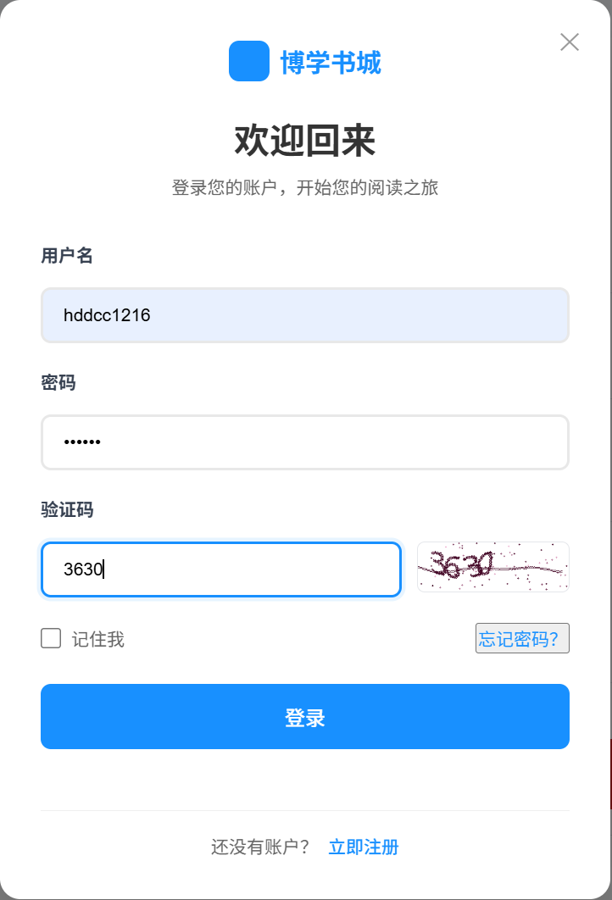
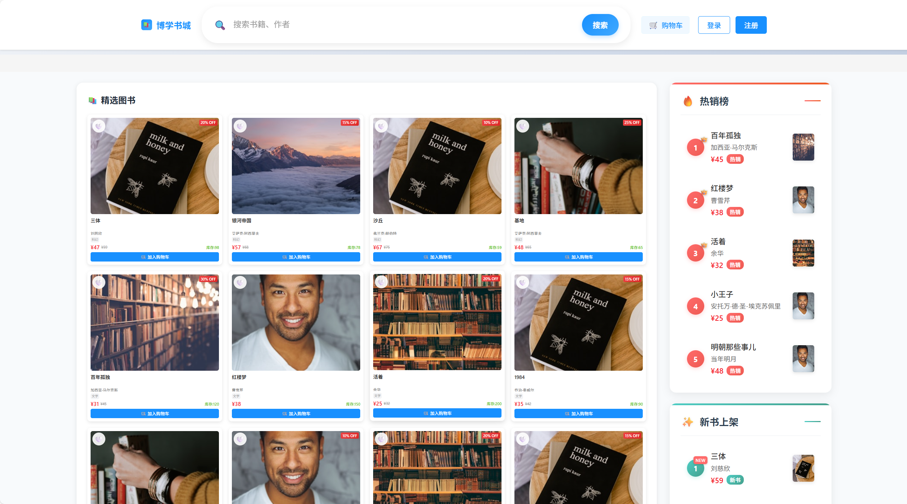
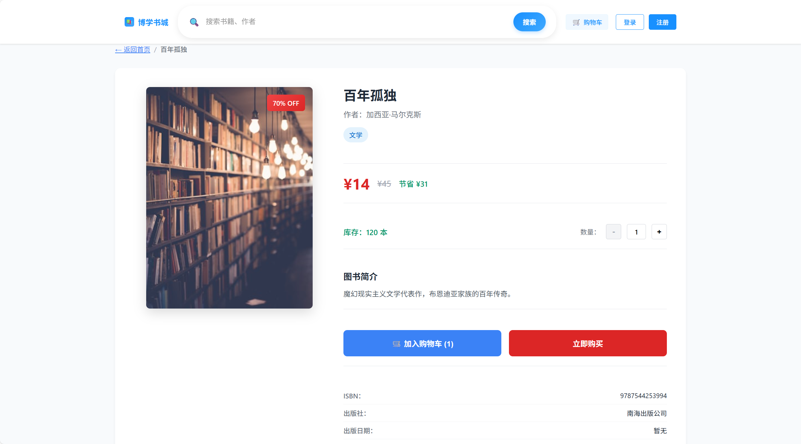
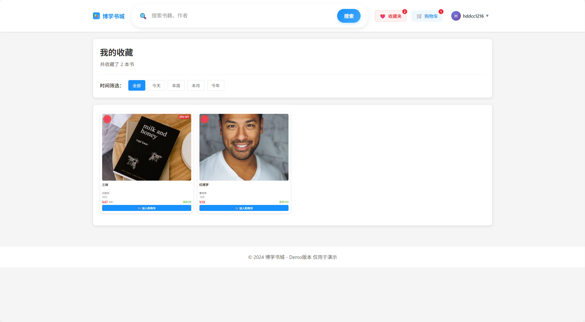
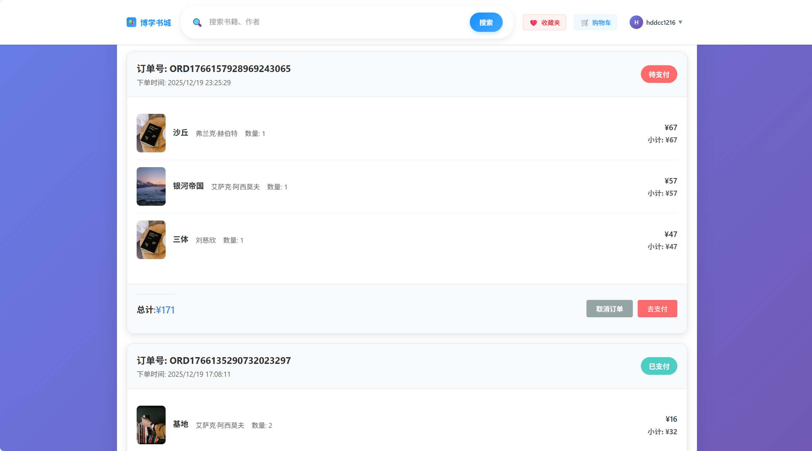
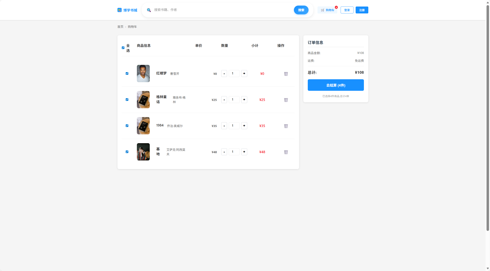

# 在线图书电商平台 (Online Bookstore)

基于 Go (Gin) 和 React 构建的 B2C 图书电商系统。涵盖用户管理、商品检索、购物车、订单交易等核心业务模块，并采用容器化方案进行部署。

## 技术架构

### 后端服务 (Go + Gin)
*   **Web 框架**: 使用 Gin 框架构建 RESTful API，处理路由分发与参数绑定。
*   **基础架构**: 集成 **Snowflake** 算法生成全局唯一 ID，解决分布式环境主键冲突；引入 **Zap** + **Lumberjack** 构建高性能结构化日志系统。
*   **数据访问**: 基于 GORM 进行 ORM 映射。针对 N+1 查询问题使用了 `Preload` 预加载机制，并配合数据库索引优化查询性能。
*   **业务逻辑**: 采用 Controller-Service-Repository 分层架构，实现业务逻辑与数据访问的解耦。

### 中间件集成
*   **Redis 缓存**:
    *   **缓存策略**: 采用 Cache-Aside（旁路缓存）模式，热点数据优先读取缓存，未命中则查询数据库并回写。
    *   **实时榜单**: 基于 Redis **ZSet** 构建热销/新书榜。利用 **Pipeline** 在启动时极速预热，并通过支付回调实现榜单实时刷新。
    *   **库存预热**: 秒杀场景下使用 `DECR` 原子操作进行库存预扣减，实现流量拦截。
    *   **失效控制**: 引入随机 TTL（Jitter）机制，防止缓存集中失效带来的数据库压力。
*   **RabbitMQ 消息队列**:
    *   **异步削峰**: 将下单流程异步化。HTTP 接口仅负责生产消息，后台 Consumer 负责消费消息并执行扣库存与写库操作，实现高并发场景下的流量削峰。
    *   **可靠性**: 实现了消息的手动确认（Manual Ack）与死信队列（DLQ）兜底机制，防止异常消息丢失。
    *   **优雅停机**: 集成 `Graceful Shutdown`，确保服务重启时正在处理的消息不丢失。

### 部署架构 (Docker)
*   **容器化**: 项目包含完整的 `Dockerfile` 与 `docker-compose.yml` 配置。
*   **服务编排**: 一键编排 Go 应用、MySQL、Redis、RabbitMQ 四个服务容器，实现了网络互通与数据卷持久化。

## 功能模块

1.  **用户模块**: JWT 身份认证、注册登录、个人信息管理。
2.  **商品模块**: 图书列表分页展示、多条件模糊搜索、详情页展示。
3.  **交易模块**: 购物车管理、订单创建（异步）、订单状态流转。


## 项目演示 (UI Showcase)

| 模块&nbsp;&nbsp;&nbsp;&nbsp;&nbsp;&nbsp;&nbsp;&nbsp;&nbsp;&nbsp;&nbsp;&nbsp; | 截图 | 说明 |
| :--- | :--- | :--- |
| **登录/注册** |  | 用户认证入口，集成验证码防御。 |
| **首页浏览** |  <br>  | 热门图书与图书分类展示。 |
| **图书详情** |  | 书籍详细信息，支持加入购物车/收藏。 |
| **我的收藏** |  | 个人收藏夹管理。 |
| **订单管理** |  | 历史订单列表与状态追踪。 |
| **模拟支付** |  | 购物车页面，模拟三方支付页面与二维码生成。 |

## 运行说明

**前置条件**: 已安装 Docker 及 Docker Desktop。

1.  **启动服务**:
    ```bash
    docker-compose up -d --build
    ```

2.  **访问地址**:
    *   Web 页面: `http://localhost:8080`
    *   API 接口: `http://localhost:8080/api/v1/...`
